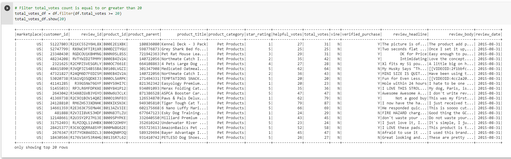
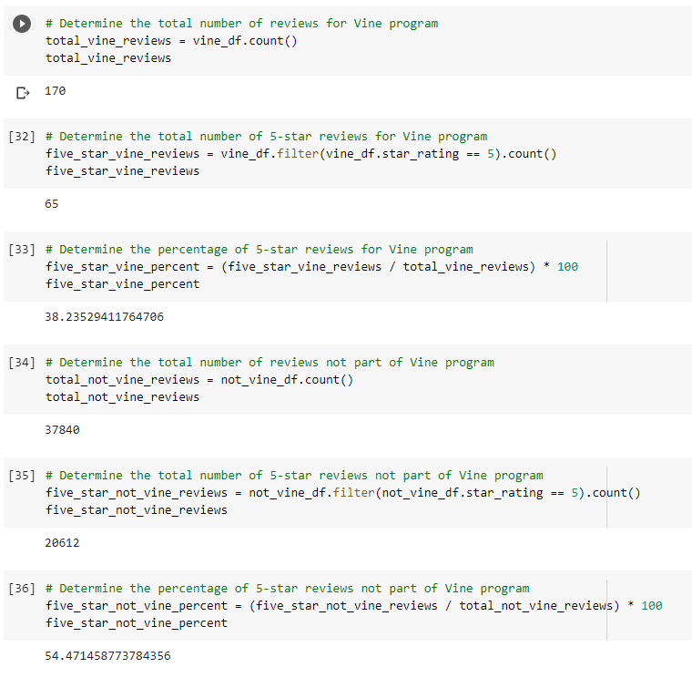

# Amazon Vine Analysis

## Overview of the Amazon Vine Analysis

### Purpose

##### The purpose of Module Sixteen and the Amazon Vine Analysis is to introduce Big Data using Google Colab, PySpark, AWS RDS, and AWS Simple Storage Service (S3) in a PostgreSQL database to analyze Amazon customer reviews.  For this analysis, the Amazon product category of Pet Products will be analyzed to determine if positivity bias exists when Amazon Vine members, who are provided these products and required to publish a review, review the products.

### Results from the 38,010 reviews of Amazon Pet Products:

- 170 reviews were conducted by Vine members and the remaining 37,840 were not completed by Vine members

- 65 5-star reviews were conducted by Vine members and the remaining 20,612 were not completed by Vine members

- 38% of Vine members rated the pet products at 5-stars and 54% of non-Vine members rated the pet products at 5-stars

### Summary

Based on the analysis, it can be concluded that there did not appear to be positivity bias for reviews by Amazon Vine members in the 5-star rating category. An additional analysis I'd perform with the dataset is to determine the total number of 4-star reviews by both Vine members and non-Vine members to determine if positivity bias exists at a 4-star rating instead of a 5-star rating.

